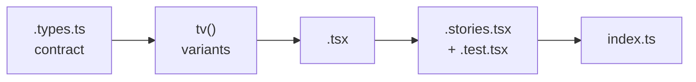

# UI Primitive Standards

> **Purpose.** Generic pattern for writing **UI primitive components**: the grammar of how each primitive is built — prop contract, styling by variants, composition, living doc and test. **Each section splits into two parts:**
> - **🌐 Generic pattern** — the **portable law**: Concept + Pattern + an **Invariants** table indexing each rule by a stable id `XXX-n`. Holds in any UI stack (React, Vue, etc.); the text stays true after swapping frameworks.
> - **🛠️ Project-specific** — the **code** that implements each rule in the current stack: Mechanisms per rule + ✅ How to do it + ❌ Never do. Swapping stacks rewrites **only** this part.
>
> Reviews bind by **id** (`XXX-n`), never by file/line: they read the invariant in the 🌐 part and the detector/example in the 🛠️ part.
>
> **Markers:**
> - `XXX-n` **constitutional** — portable invariant (holds in any stack). `XXX-Ln` **stack lint** — exists only because of the current language/lib ergonomics and inverts in another stack; still id-registered and enforced.
>
> **Reference stack (🛠️ part):** TypeScript · React 19 · headless primitives (`@base-ui/react`) · tailwind-variants (`tv`) · Tailwind CSS v4 · Storybook · Vitest + Testing Library · Biome via `@turystack/frontend-config`. Style: 2 spaces · single quotes · no semicolons.
>
> **⚠️ Comments in the examples are didactic** — they explain the rule being demonstrated there. **Never copy a comment into the code**: the standard is zero comments.

## Context (check BEFORE writing any component)

A primitive lives in one of two places — **the grammar is identical in both**:

| | Shared library (`@turystack/react-web`) | App-local (the app's `src/ui/`) |
|---|---|---|
| When | generic, reusable across products | product-specific |
| Structure | `src/components/<name>/` | `src/ui/<name>/` |
| Files | 5 — `.tsx` · `.types.ts` · `.stories.tsx` · `.test.tsx` · `index.ts` | 4 — the same ones, without `.stories.tsx` |
| Living doc | Storybook — one story per variation | `.types.ts` + real usage in the routes |
| Exports | the library's root barrel (`src/index.ts`) | the `src/ui/index.ts` barrel |
| Before creating | confirm it does not exist in the barrel | confirm it exists neither in the library **nor** in `src/ui/` |

**Order of preference:** new prop/variant on an existing primitive → new primitive in the library (if generic) → app-local primitive in `src/ui/` (if specific) → **duplicating, never**.

## Mental model

**Build flow** (the contract comes first; the implementation obeys the contract):

**Recurring decisions (always question them):**

- Need a different **look** → a new `variant`/`size` in the component's `tv()` — never a class coming from outside.
- Need a different **behavior** → a semantic prop; research what Mantine/Ant Design/Chakra call the same concept before inventing a name.
- The **app** wants to customize → theme (design tokens selected in the root Provider), decided once — never per instance.
- Several elements with **shared state** → compound component with internal context.

## Invariants (the most broken ones)

1. **`className`/`style` are never public props** — the whole visual resolve is internal, via `tv()`; app customization is a theme decision (tokens in the Provider), never an instance one.
2. **A prop dictates behavior** — semantic API (`variant`, `size`, `loading`, `block`), never a CSS passthrough.
3. **Every component = the complete file set for its context**: `.tsx` · `.types.ts` · `.test.tsx` · `index.ts` — and, in the library, `.stories.tsx` (the barrel exports component + types; named export, never default).
4. **Strongly typed contract**: every value domain is a named, exported union; controlled/uncontrolled as the `value`/`defaultValue`/`onChange` pair; `onChange` delivers the value, never the DOM event.
5. **An interactive element is never raw HTML** — always an accessible headless primitive.
6. **Before inventing a prop, read the real `.types.ts`**; capability missing → extend the primitive (library first), never work around it in the app.
